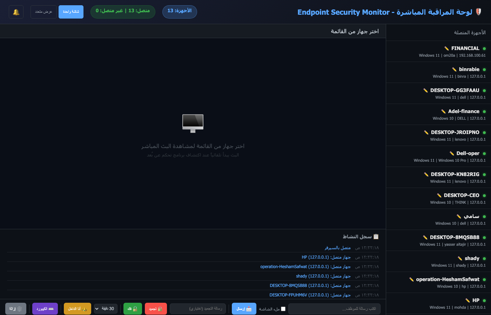
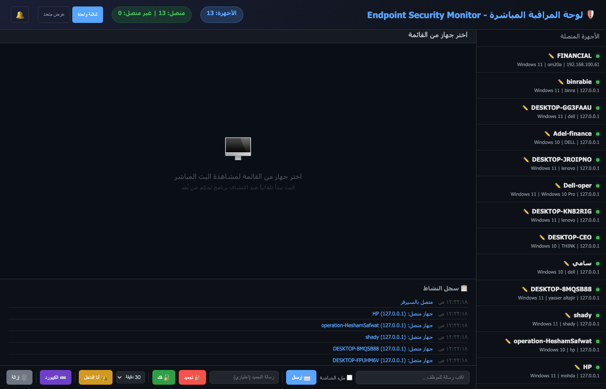

# 🛡️ Endpoint Security Monitor

A comprehensive endpoint security monitoring and protection system for organizations. Detect unauthorized remote access, monitor device activity in real-time, and enforce access control policies across your network.

## Dashboard Preview





## Features

- **Real-time Remote Access Detection** — Detects 25+ remote access tools (AnyDesk, TeamViewer, VNC, RustDesk, etc.)
- **Admin Approval System** — Unauthorized remote access is blocked instantly until admin approves
- **Live Screen Streaming** — Watch any device's screen in real-time from the web dashboard
- **Keystroke Logging** — Captures all keystrokes during unauthorized sessions (including passwords)
- **Device Freeze** — Instantly disable keyboard/mouse on compromised devices
- **Admin Messaging** — Send messages directly to any device screen
- **Admin Bypass Mode** — Disable monitoring when you (the admin) are the one connecting
- **Employee Registration** — Each device is registered with employee name, ID, and department
- **Email Alerts** — HTML reports with screenshots sent to security team
- **USB Monitoring** — Detect new USB devices
- **File Change Detection** — Ransomware-style bulk change alerts
- **Software Installation Tracking** — Detect newly installed software
- **Cross-Platform** — Windows, macOS, Linux

## Architecture

```
┌─────────────────────┐         ┌──────────────────────────────────┐
│   Admin Dashboard    │◄────────│     Employee Device (Agent)      │
│   (Your Machine)     │         │                                  │
│                      │  WebSocket  ├─ agent.py (core monitor)    │
│  dashboard_server.py │◄────────────┤─ access_control.py (blocker)│
│                      │             ├─ stream_client.py (live feed)│
│  http://localhost:5000│            ├─ activity_monitor.py         │
│                      │             └─ advanced_protection.py      │
└─────────────────────┘         └──────────────────────────────────┘
```

## Quick Start

### 1. Admin Dashboard (your machine)

```bash
pip install flask flask-socketio gevent gevent-websocket
python dashboard_server.py
```
Open browser: `http://localhost:5000`

**Windows:** Double-click `start_dashboard.bat`

### 2. Configure `config.json`

```json
{
  "email": {
    "sender_email": "alerts@yourcompany.com",
    "sender_password": "your-gmail-app-password"
  },
  "live_stream": {
    "dashboard_url": "http://YOUR-ADMIN-IP:5000"
  }
}
```

### 3. Install on Employee Devices

**Windows:**
```
Right-click install_windows.bat → Run as Administrator
```

**macOS:**
```bash
sudo ./install_macos.sh
```

**Linux:**
```bash
sudo ./install_linux.sh
```

### 4. Verify Setup

```bash
python check_setup.py
```

## Bulk Deployment

Deploy to all network devices at once:

**Windows devices (PowerShell Remoting):**
```powershell
.\deploy_remote.ps1
```

**macOS/Linux devices (SSH):**
```bash
./deploy_remote_ssh.sh
```

## Dashboard Controls

| Control | Function |
|---------|----------|
| ✅ Approve | Allow remote access for a set duration |
| ❌ Deny | Block and kill the remote access app |
| 📩 Message | Send a popup message to the device |
| 🔒 Freeze | Disable keyboard/mouse on the device |
| 🔓 Unfreeze | Re-enable input |
| 👑 Admin Bypass | Disable monitoring (when you are connecting) |
| ⌨️ Keystrokes | View live keystrokes including passwords |
| 🔴 Revoke | Immediately terminate an approved session |

## How It Works

1. Agent runs silently on employee devices
2. Employee works normally — no interference with daily tasks
3. When remote access software is detected:
   - App is **killed and blocked** instantly
   - Employee sees a notification: *"This app requires admin approval"*
   - Admin receives a **real-time alert** on the dashboard
   - Admin **approves or denies** from the browser
   - If approved: live streaming + keystroke logging begins
   - Session auto-expires after the set duration

## Detected Remote Access Software

AnyDesk, TeamViewer, RustDesk, Chrome Remote Desktop, Splashtop, Parsec, LogMeIn, VNC (Real/Tight/Ultra/Tiger), Radmin, Supremo, Ammyy Admin, MeshCentral, DWService, NoMachine, RemotePC, ScreenConnect/ConnectWise, Zoho Assist, Dameware, NetSupport, Remote Utilities

## Requirements

- Python 3.8+
- Network connectivity between admin and employee devices (port 5000)
- Administrator/root privileges on employee devices
- Gmail App Password for email alerts ([setup guide](https://myaccount.google.com/apppasswords))

## File Structure

```
endpoint-monitor/
├── dashboard_server.py       # Admin web dashboard
├── agent.py                  # Core monitoring agent
├── access_control.py         # Access blocking & approval system
├── stream_client.py          # Live screen streaming client
├── activity_monitor.py       # Activity recording module
├── advanced_protection.py    # Keystroke capture, freeze, messaging
├── config.json               # Configuration
├── check_setup.py            # Installation verifier
├── requirements.txt          # Python dependencies
├── start_dashboard.bat/sh    # Quick-start scripts
├── install_windows.bat       # Windows installer
├── install_macos.sh          # macOS installer
├── install_linux.sh          # Linux installer
├── deploy_remote.ps1         # Bulk deploy (Windows)
├── deploy_remote_ssh.sh      # Bulk deploy (SSH)
├── uninstall_windows.bat     # Windows uninstaller
├── uninstall.sh              # macOS/Linux uninstaller
└── computers.txt             # Device list for bulk deploy
```

## License

MIT License — see [LICENSE](LICENSE)

## Disclaimer

This software is intended for authorized security monitoring within organizations. Ensure you comply with local laws and obtain proper consent before deploying monitoring software on devices. The authors are not responsible for any misuse.
